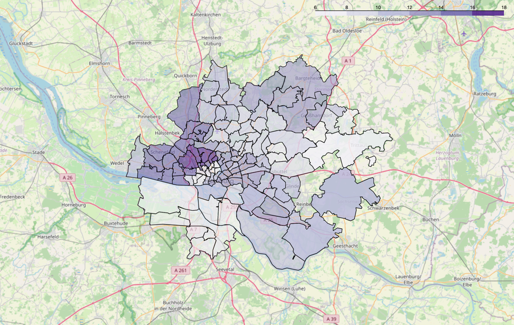

# Wasserhärte aufgeschlüsselt nach PLZ 
  
Die nachfolgende Grafik präsentiert die Wasserhärte innerhalb des Versorgungsgebiets von 
[Hamburg Wasser](https://www.hamburgwasser.de/startseite). Für PLZs, für die mehrere Wasserwerke zuständig sind, wurde 
der Mittelwert als repräsentativer Wert herangezogen.